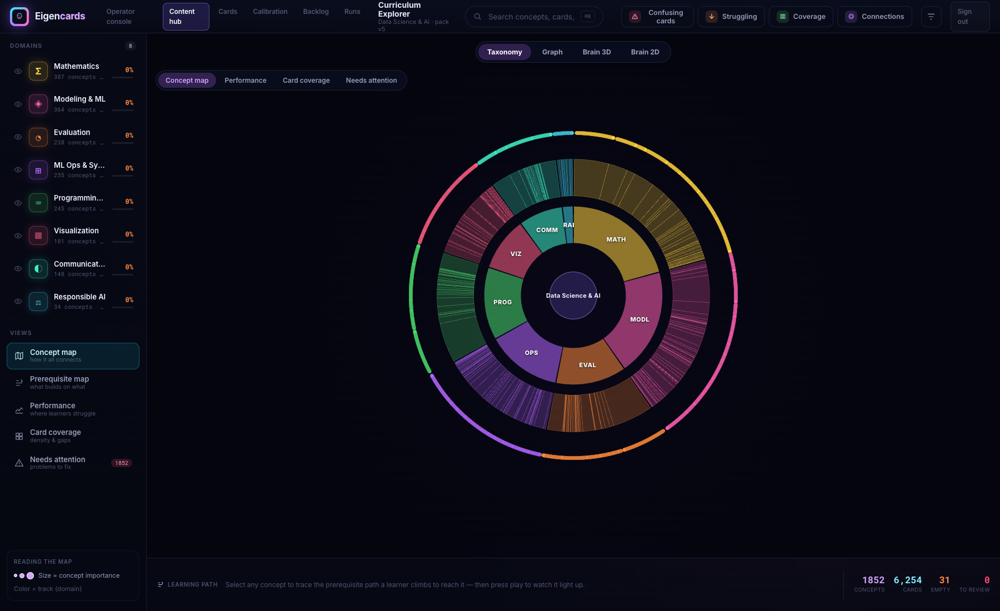
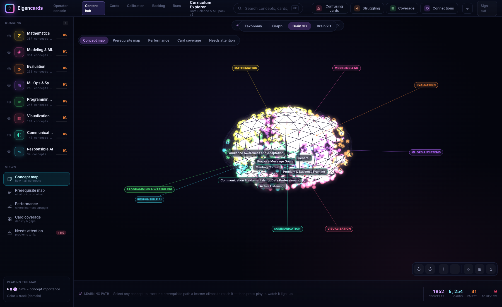
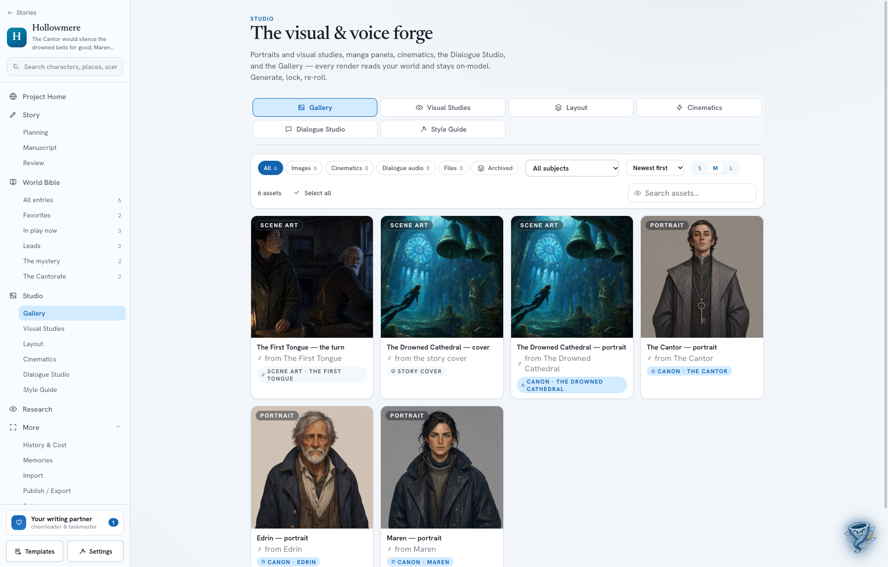
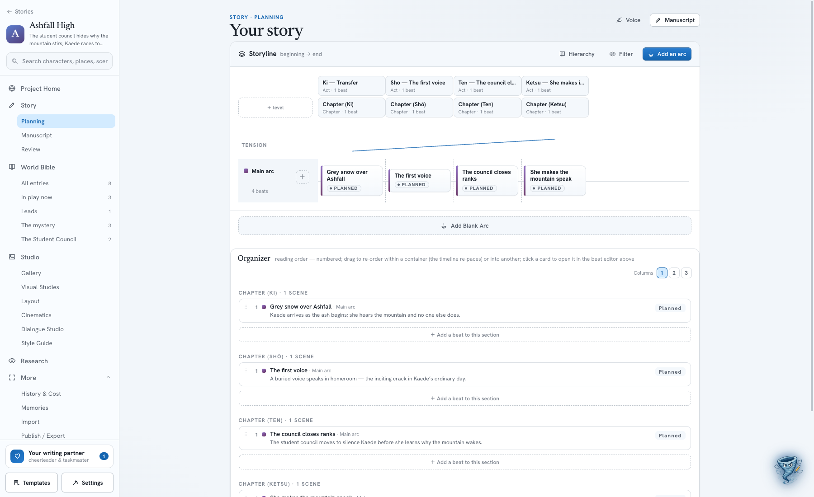
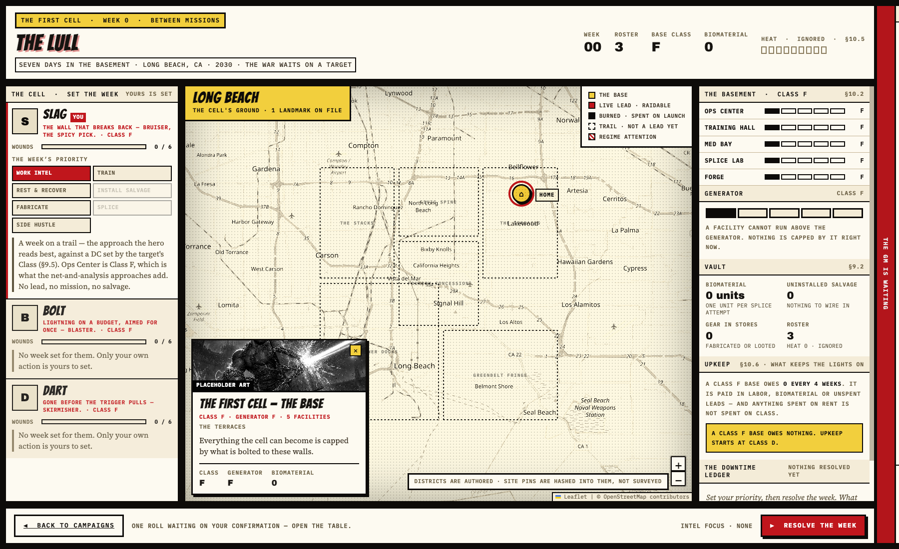

# David Hook

I build tools for AI coding agents, and apps that use them. Mostly TypeScript and Python, some Swift.

## Open source

**[scrumux-cli](https://github.com/LBDavid98/scrumux-cli-public)** — A governance harness for AI coding agents. It installs into your repo and keeps the state of the work in JSON files: tasks, scope, decisions, receipts from test runs. A new session reads those instead of re-deriving everything by grepping. Four kinds of action are blocked by pre-tool hooks, including the agent editing the harness itself.

**[react-lane-timeline](https://github.com/LBDavid98/react-lane-timeline)** — A swimlane timeline for React. Items sit in lanes, positioned either by a continuous value (0.34 of the way through) or by a named bucket (now / next / later). Drag and full keyboard support, and the layout math is a separate module with no React in it.

**[react-agent-chat-window](https://github.com/LBDavid98/react-agent-chat-window)** — A chat window you can drop into an app that talks to an agent. It renders structured widgets inline, so the agent can offer buttons, forms and approve/deny cards instead of asking you to type "yes". You supply the transport and the theme.

**[pgboss-scheduler](https://github.com/LBDavid98/pgboss-scheduler)** — Scheduled and queued jobs over HTTP, built on pg-boss and Postgres. Push to a URL or let workers pull, HMAC-signed deliveries, cron with real timezone handling, and a dead letter queue for every queue by default.

**[asc-testflight-feedback](https://github.com/LBDavid98/asc-testflight-feedback)** — Pulls TestFlight beta feedback for every app on your App Store Connect team into Postgres and serves it over a small read API. Apple only shows this in App Store Connect and there's no export.

All MIT. Each one came out of an app I was building and got its own repo once a second app needed it.

## Screenshots

These are from private commercial projects, so there's no code to link. Putting them here because they're the work I find most interesting.

### Eigencards

A spaced repetition app for data science and ML, with an iOS client. This is the operator console over the content pipeline — 1,852 concepts and 6,254 cards, each scored 800–2400 for difficulty based on where it sits in a hand-mapped prerequisite graph, then adjusted by an IRT-2PL pass against real answer data.

It draws the same graph several ways, since a curriculum that size is hard to review in a table.

The 3D view projects all 1,852 concepts onto brain anatomy, coloured by domain. It's the quickest way to spot a domain that's grown lopsided.

Card generation is a LangGraph pipeline in Python. Every factual claim on a card gets extracted and entailment-checked against a per-track allowlist of authoritative sources before it ships.

### DraftNado

A local-first AI writing suite. The manuscript lives in SQLite compiled to wasm, running in your browser, so the text stays on your machine.

The Studio handles the visual side: portraits, scene art, manga panel layouts, cinematics and a dialogue studio. Everything reads from the same World Bible, so a character looks the same across every render.

The planning board underneath it is where react-lane-timeline came from — arcs as lanes, beats along them, tension plotted over the top.

### Mission Control

An AI game master for a tabletop RPG. It runs scenes, voices NPCs and applies rules, but the authored module stays authoritative and a human moderator has final say. Game state lives in an event-sourced database and the model reads from it, so it can't drift or contradict itself about what happened.

Below is the downtime week between missions. Each player gets one action, and the map, the base and the cell's upkeep are all in view while they choose.

The bar at the bottom says one roll is waiting on player confirmation. The GM doesn't roll against a player until they say go.

## scrumux is open core

The CLI is free and MIT. It installs into your repo, keeps working if you delete the clone, and doesn't phone home.

The control plane is the paid part: one view across every repo, sorted by what's actually waiting on you, so you're not opening each one in turn to find out which is stuck.

Commercial enquiries: **scrumux@businesskat.com**
